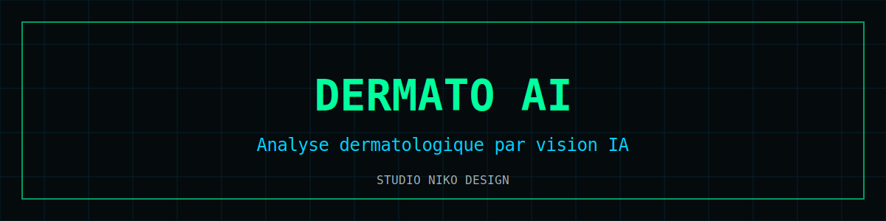

# Dermato AI

  

Outil d'**analyse dermatologique assistée par vision artificielle** : capture ou import d'image, analyse par modèle de vision, restitution pédagogique.

**Démo** : [nikoju1977.github.io/dermato-ai](https://nikoju1977.github.io/dermato-ai/)

## Fonctionnalités

- 📷 Capture caméra ou import d'image
- 👁️ Analyse par modèle de vision **Pixtral (Mistral AI)**
- 📝 Restitution structurée et pédagogique
- 🔐 Image traitée à la demande, aucun stockage serveur
- 📱 PWA mobile-first

## Stack

`HTML/CSS/JS single-file` · `Pixtral / Mistral AI` · `MediaPipe` · `PWA` · `safeStorage`

## Lancer en local

Ouvrir `index.html` et autoriser la caméra.

## ⚠️ Avertissement médical

Cette application est un **outil d'information et de suivi personnel**. Elle ne constitue pas un dispositif médical certifié, ne fournit ni diagnostic ni prescription, et ne remplace en aucun cas l'avis d'un professionnel de santé. En cas d'urgence : **15 (SAMU)** ou **112**.

> Une lésion cutanée qui change, saigne ou persiste doit être montrée à un **dermatologue** — aucune IA ne remplace un examen clinique.

## Licence

[MIT](LICENSE) © 2026 Nicolas Julienne — Studio Niko Design
